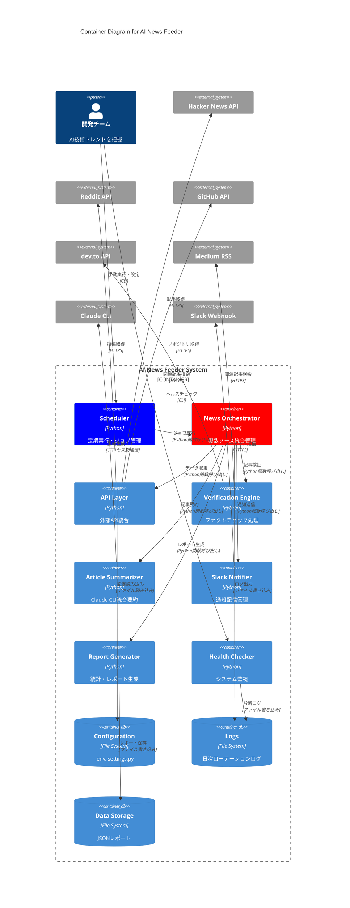

# C4 Container Diagram - AI News Feeder

## 🏗️ コンテナ構成図



## 📦 コンテナ詳細仕様

### 🎯 Scheduler（スケジューラー）
**責任**: 定期実行・ジョブ管理・CLI制御

**技術スタック**:
- Python 3.8+ 
- `schedule`ライブラリ
- `argparse`（CLI）

**主要機能**:
- 日次自動実行（毎日9:00AM）
- 手動実行モード（`--run-once`）
- ヘルスチェック実行（`--health-check`）
- cron/launchd統合

**インターフェース**:
```python
class AINewsScheduler:
    def start_scheduler()
    def run_verification_job()
    def stop_scheduler()
```

**設定依存**:
- `CHECK_INTERVAL_HOURS`: 実行間隔
- `MAX_ARTICLES_PER_DAY`: 処理制限

---

### 🎼 News Orchestrator（統合オーケストレーター）
**責任**: 複数ソース統合管理・処理フロー制御

**技術スタック**:
- Python 3.8+
- `dataclasses`（データ構造）
- `asyncio`（将来の並列処理）

**主要機能**:
- 3ソース（Hacker News、Reddit、GitHub）統合
- 重複記事除去
- 処理統計管理
- エラーハンドリング

**インターフェース**:
```python
class NewsOrchestrator:
    def collect_and_process_news() -> OrchestrationResult
    def _deduplicate_articles()
    def _generate_processing_stats()
```

**データフロー**:
```
API Layer → Verification → Summarization → Notification → Reporting
```

---

### 🔌 API Layer（API統合層）
**責任**: 外部API統合・データ正規化

**技術スタック**:
- `requests`（HTTP通信）
- `praw`（Reddit API）
- `PyGithub`（GitHub API）

**モジュール構成**:
- `src/api/hacker_news.py`: Hacker News API
- `src/api/reddit_api.py`: Reddit API（PRAW）
- `src/api/github_trending.py`: GitHub API

**共通インターフェース**:
```python
def get_ai_related_articles() -> List[Dict]
def filter_by_keywords(articles, keywords) -> List[Dict]
def convert_to_standard_format(article) -> Dict
```

**レート制限対応**:
- Hacker News: 0.1秒間隔
- Reddit: 1秒間隔（60req/分制限）
- GitHub: API制限監視

---

### ✅ Verification Engine（検証エンジン）
**責任**: 記事の信憑性検証・ファクトチェック

**技術スタック**:
- `requests`（HTTP通信）
- `BeautifulSoup`（RSS解析）

**検証ソース**:
- dev.to API: 開発者コミュニティ記事
- Medium RSS: 技術ブログ記事

**検証ロジック**:
```python
def verify_article(article) -> Dict:
    related_articles = search_related_articles(article.title)
    verification_score = calculate_verification_score(related_articles)
    return {
        'status': 'verified' if related_articles >= 1 else 'unverified',
        'related_count': len(related_articles),
        'sources': ['dev.to', 'medium']
    }
```

**検証基準**:
- 関連記事1件以上: "verified"
- 関連記事0件: "unverified"

---

### 📝 Article Summarizer（記事要約器）
**責任**: Claude CLI統合・日本語要約生成

**技術スタック**:
- `subprocess`（プロセス間通信）
- `BeautifulSoup`（コンテンツ抽出）
- Claude CLI（外部プロセス）

**要約プロセス**:
1. 記事URLからコンテンツ取得
2. Claude CLIでプロンプト処理
3. 3-4文の日本語要約生成
4. エラーハンドリング・フォールバック

**Claude CLI統合**:
```python
def _call_claude_cli(prompt: str) -> str:
    # 複数の呼び出し戦略でフォールバック
    strategies = [
        ["claude", "-p", prompt, "--output-format", "text"],
        ["claude", "chat", "--file", temp_file],
        ["claude", "--print", prompt]
    ]
```

**可用性管理**:
- CLI存在確認
- バージョン検証
- 認証状態確認

---

### 📢 Slack Notifier（Slack通知器）
**責任**: Slack通知配信・メッセージフォーマット

**技術スタック**:
- `requests`（Webhook通信）
- Slack Incoming Webhook

**メッセージフォーマット**:
```
📊 AI News Verification Report
✅ Topic: [記事タイトル]
🔗 Source: [ソース名] (Score: [スコア])
📈 Verified: [関連記事数] related articles found
📚 Links: dev.to([件数]), Medium([件数])
🌐 URL: [記事URL]
⏰ Checked: [確認日時]

📝 要約:
[Claude CLIによる3-4文の日本語要約]
```

**通知制御**:
- 検証レベル別フィルタリング
- 日次サマリー機能
- エラー通知機能

---

### 📊 Report Generator（レポート生成器）
**責任**: 統計・レポート生成・データ永続化

**技術スタック**:
- `json`（データシリアライゼーション）
- `statistics`（統計計算）

**レポート内容**:
```json
{
  "date": "2025-09-23",
  "summary": {
    "total_articles": 15,
    "verified_articles": 12,
    "summarized_articles": 10,
    "processing_time": 180.5
  },
  "sources": {
    "hacker_news": 8,
    "reddit": 4,
    "github": 3
  },
  "performance_metrics": {
    "avg_processing_time_per_article": 12.03,
    "verification_success_rate": 0.8,
    "summarization_success_rate": 0.83
  }
}
```

---

### 🏥 Health Checker（ヘルスチェッカー）
**責任**: システム監視・診断・可用性確認

**監視対象**:
- 外部API接続状況
- Claude CLI可用性
- ファイルシステム状況
- システムリソース

**ヘルスチェック項目**:
```python
def run_full_health_check() -> Dict:
    return {
        'hacker_news_api': check_hacker_news_api(),
        'dev_to_api': check_dev_to_api(),
        'medium_rss': check_medium_rss(),
        'claude_cli': check_claude_cli(),
        'slack_webhook': check_slack_webhook(),
        'system_resources': check_system_resources()
    }
```

**診断レポート**:
- 各コンポーネントの状態（healthy/degraded/unhealthy）
- レスポンス時間測定
- エラー詳細情報

---

## 💾 データストレージ

### Configuration（設定管理）
**場所**: `.env`, `config/settings.py`

**設定カテゴリ**:
- API認証情報（APIキー、トークン）
- 機能フラグ（ENABLE_REDDIT、ENABLE_SUMMARIZATION）
- 閾値・制限（スコア閾値、記事数制限）
- パス・URL（Claude CLI、Slack Webhook）

### Logs（ログ管理）
**場所**: `logs/`ディレクトリ

**ログファイル**:
- `ai_news_feeder_YYYYMMDD.log`: 日次アプリケーションログ
- `claude_cron_test_*.{meta,out,err}`: Claude CLI診断ログ
- `launchd.{out,err}.log`: LaunchAgent実行ログ

**ログレベル**:
- INFO: 正常処理フロー
- WARNING: 軽微な問題・フォールバック
- ERROR: 処理失敗・システムエラー

### Data Storage（データ永続化）
**場所**: `data/`ディレクトリ

**データファイル**:
- `ai_news_report_YYYYMMDD.json`: 日次処理レポート
- `unified_ai_news_report_YYYYMMDD.json`: 統合レポート

**データ保持期間**: 無制限（手動削除）

---

## 🔄 コンテナ間通信

### 同期通信（Python関数呼び出し）
- Scheduler ↔ Orchestrator
- Orchestrator ↔ 各処理モジュール
- 全モジュール ↔ Configuration

### 非同期通信（将来実装）
- `asyncio`による並列処理
- キューベースのジョブ管理

### 外部通信（HTTPS/プロセス間）
- API Layer → 外部API（HTTPS）
- Summarizer → Claude CLI（プロセス間通信）
- Notifier → Slack（HTTPS Webhook）

### ファイルシステム通信
- 全モジュール → Logs（書き込み）
- Reporter → Data Storage（書き込み）
- Scheduler → Configuration（読み込み）

---

**作成日**: 2025-09-23  
**責任者**: アーキテクチャ設計チーム  
**次回見直し**: Phase 3完了時（2025-10-28）  
