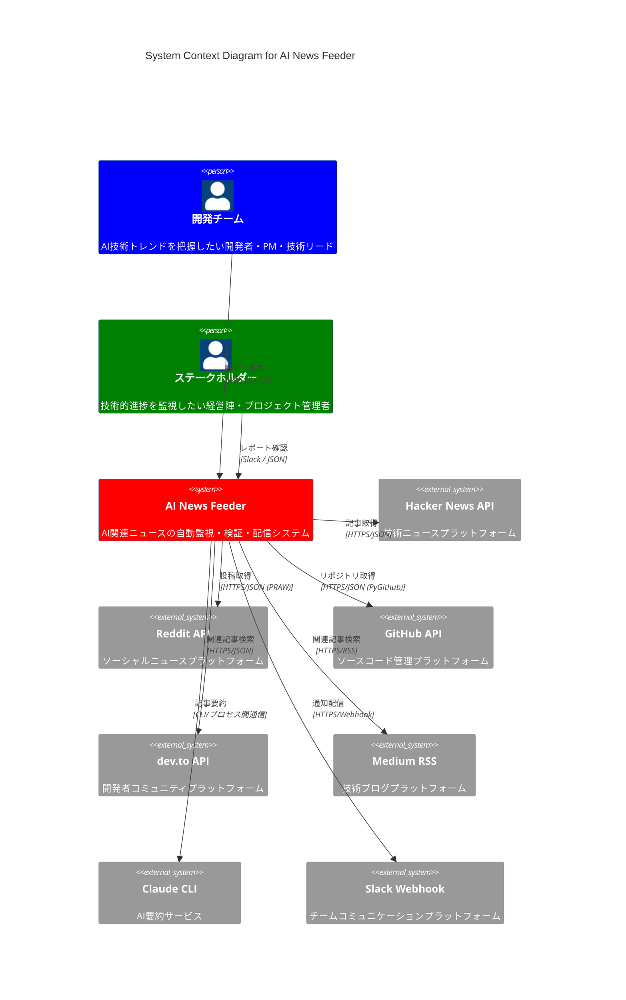

# C4 Context Diagram - AI News Feeder

## 🌐 システムコンテキスト図



## 📊 システム境界と責任

### 🎯 AI News Feeder（中核システム）

**責任範囲**:
- AI関連ニュースの自動収集・フィルタリング
- 記事の信憑性検証（ファクトチェック）
- Claude CLIを使用した日本語要約生成
- Slackへの構造化通知配信
- 処理結果の統計・レポート生成

**技術的境界**:
- Python 3.8+ベースのスタンドアロンアプリケーション
- 外部APIとの統合によるデータ収集
- ローカルファイルシステムでの設定・ログ管理

### 👥 ユーザー・ステークホルダー

#### プライマリーユーザー（開発チーム）
- **開発者**: 最新AI技術トレンドの把握
- **プロダクトマネージャー**: 市場動向の監視
- **技術リード**: 技術選定の参考情報収集

**インタラクション**:
- 設定ファイル（`.env`）による機能カスタマイズ
- CLIコマンドによる手動実行・テスト
- ログファイルによる動作状況確認

#### セカンダリーユーザー（ステークホルダー）
- **経営陣**: 技術投資判断の参考情報
- **プロジェクト管理者**: 開発チームの技術キャッチアップ状況監視

**インタラクション**:
- Slackでの日次レポート受信
- JSONレポートによる詳細分析

### 🔌 外部システム統合

#### データソース（情報収集）

**Hacker News API** 🥇
- **役割**: 主要ニュースソース
- **データ**: トップストーリー、スコア、コメント数
- **制限**: レート制限（推奨0.1秒間隔）
- **信頼性**: 高（技術コミュニティで信頼されているプラットフォーム）

**Reddit API** 🥈
- **役割**: コミュニティ投稿収集
- **データ**: r/MachineLearning等のAI関連subreddit投稿
- **制限**: 60リクエスト/分、OAuth2認証必須
- **信頼性**: 中（コミュニティベースのため品質にばらつき）

**GitHub API** 🥉
- **役割**: トレンディングリポジトリ監視
- **データ**: AI関連プロジェクト、スター数、README
- **制限**: 5,000リクエスト/時（認証時）
- **信頼性**: 高（実際のコード・プロジェクトベース）

#### 検証ソース（ファクトチェック）

**dev.to API**
- **役割**: 技術記事での関連情報検索
- **データ**: 記事タイトル、内容、公開日
- **制限**: 一般的なレート制限
- **信頼性**: 中〜高（開発者コミュニティベース）

**Medium RSS**
- **役割**: 技術ブログでの関連情報検索
- **データ**: RSS形式の記事メタデータ
- **制限**: RSS取得制限
- **信頼性**: 中（個人ブログ含むため品質にばらつき）

#### AI・通知サービス

**Claude CLI**
- **役割**: 記事の日本語要約生成
- **データ**: 記事内容 → 3-4文の日本語要約
- **制限**: APIキー必須、処理時間（60秒タイムアウト）
- **信頼性**: 高（Anthropic社の高性能AI）

**Slack Webhook**
- **役割**: チーム通知配信
- **データ**: 構造化メッセージ（記事情報、要約、検証結果）
- **制限**: Webhook URL設定必須
- **信頼性**: 高（企業向けプラットフォーム）

## 🔄 主要データフロー

### 1. 記事収集フロー
```
Hacker News API → フィルタリング（AIキーワード、スコア閾値）
Reddit API → フィルタリング（subreddit、スコア、AI関連）
GitHub API → フィルタリング（トピック、言語、AI関連）
```

### 2. 検証フロー
```
収集記事 → dev.to検索 → Medium検索 → 関連記事数評価 → 検証ステータス決定
```

### 3. 要約フロー
```
記事URL → コンテンツ取得 → Claude CLI → 日本語要約生成
```

### 4. 通知フロー
```
検証済み記事 + 要約 → Slackメッセージ構築 → Webhook送信
```

## 🛡️ セキュリティ境界

### 認証・認可
- **Reddit**: OAuth2認証（client_id, client_secret）
- **GitHub**: Personal Access Token
- **Claude**: APIキーまたはKeychain認証
- **Slack**: Webhook URL（秘匿情報）

### データ保護
- **設定情報**: `.env`ファイルでの環境変数管理
- **ログ**: ローカルファイルシステム（`logs/`ディレクトリ）
- **レポート**: ローカルファイルシステム（`data/`ディレクトリ）

### ネットワークセキュリティ
- **HTTPS通信**: 全外部API通信でHTTPS使用
- **レート制限遵守**: 各APIの制限内での通信
- **タイムアウト設定**: 無限待機防止（10-60秒）

## 📈 スケーラビリティ考慮事項

### 現在の制約
- **処理能力**: 5記事/5分（シーケンシャル処理）
- **データソース**: 3つのAPI（Hacker News、Reddit、GitHub）
- **通知先**: 単一Slackチャンネル

### 将来の拡張性
- **並列処理**: asyncio導入による処理時間短縮
- **データソース追加**: Twitter API、Qiita API等
- **通知先拡張**: 複数Slackワークスペース、Email、Teams
- **データ永続化**: SQLiteデータベース導入

---

**作成日**: 2025-09-23  
**責任者**: アーキテクチャ設計チーム  
**次回見直し**: 2025-10-23  
